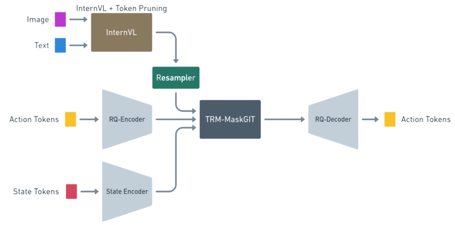

# BabyGR00T

> **Efficient Vision-Language-Action Model via Selective Distillation and Lightweight Generative Architecture**
> 
> *Minerva Labs · Monterrey, N.L., México*
>
> *VantTec · Monterrey, N.L., México*
>
> *RASTec · Monterrey, N.L., México*
> 
> **Contact**
> 
> | **Luis Sandoval** | [luisfsandsilva@gmail.com](mailto:luisfsandsilva@gmail.com) · [LinkedIn](https://www.linkedin.com/in/luisfsandsilva/) |
>
> | **Alex Hernández** | [alexhergomz@gmail.com](mailto:alexhergomz@gmail.com) · [LinkedIn](https://www.linkedin.com/in/alexhergomz/) |

<!-- TODO: add badge row once CI / HuggingFace card are live -->
<!--    -->

---

## Overview

BabyGR00T is a research initiative to train a capable, generalizable **Vision-Language-Action (VLA)** model at a fraction of the inference cost, parameter count, and training budget of current state-of-the-art embodied AI systems.

The core hypothesis is that a carefully designed small model — guided by *where* a large teacher looks, not *what* it predicts — can achieve competitive manipulation performance in a form factor suitable for resource-constrained robotic platforms.

**Key ideas:**

- **Selective attention distillation** — distill self-attention maps from GR00T N1.5/N1.6 (teacher), not trajectories or intermediate features, preserving BabyGR00T's architectural independence.
- **Efficient visual token pruning** — EVS (temporally redundant patch removal) + GAP (positional-bias-corrected token selection) before the vision-language bridge.
- **Discrete action generation** — actions are tokenized via RQ-VAE and decoded with a TRM-based MaskGIT-style iterative unmasker, replacing diffusion with a compact recursive architecture.
- **Hardware-first validation** — primary evaluation on the LeRobot SO-100 arm, a low-cost open-source 6-DoF manipulator with native GR00T ecosystem support.

---

## Architecture

BabyGR00T v0.5 is a six-module sequential inference pipeline:



### Module summary

| Module | Role | Status |
|---|---|---|
| InternVL3-1B + EVS + GAP | Vision backbone with efficient token pruning | In scope — v0.5 |
| Flamingo Perceiver Resampler | Vision-language bridge; distillation target | In scope — v0.5 |
| RQ-VAE | Continuous → discrete action tokenization | In scope — v0.5 |
| State Encoder | Encode proprioceptive states | In scope — v0.5 |
| TRM-based MaskGIT Decoder | Compact recursive action generator | In scope — v0.5 |
---

## Distillation Strategy

The GR00T teacher (SO-100 fine-tuned) runs in **inference-only mode** over the training demonstrations. We extract its **self-attention maps** and use them to supervise the resampler's attention heads.

---

## Training Pipeline

Training consists of three sequential stages:

**Stage 1 — RQ-VAE Pretraining**
Pretrain the action tokenizer on the OXE action corpus and SO-100 teleoperation demonstrations. Output: frozen RQ-VAE encoder/decoder used in all subsequent stages.

**Stage 2 — Attention Map Extraction**
Run the GR00T SO-100 teacher in inference-only mode over task demonstrations. Extract and store self-attention maps as per-frame distillation targets. One-time offline pass; no teacher weights are updated.

**Stage 3 — BabyGR00T Joint Training**

Trained modules: Resampler (full), MaskGIT decoder (full), InternVL3-1B main weights.
Frozen modules: RQ-VAE, GR00T teacher.

---

## Hardware Platform: LeRobot SO-100

Primary validation is conducted on the **LeRobot SO-100** — a low-cost, open-source 6-DoF manipulator (5 arm joints + 1 gripper) with native GR00T ecosystem support.

**Why SO-100:**
- Purpose-built for reproducible, low-cost robotics research
- NVIDIA provides official fine-tuning scripts, data configs, and evaluation scripts for SO-100/SO-101 directly in the Isaac-GR00T repository
- Native dual-camera support (front + wrist) in GR00T's data pipeline
- Active community with published GR00T N1.5/N1.6 workflows as reference baselines

### Target Tasks (v0.5)

| Task | Difficulty | Description |
|---|---|---|
| Pick-and-place | Baseline | Grasp a specified object; place in a target container. Primary regression benchmark. |
| Object sorting by visual attribute | Intermediate | Distinguish and sort by color or shape. Tests visual grounding and language conditioning. |
| Precision placement | Stretch goal | Insert or stack objects requiring fine positional control. Tests RQ-VAE action resolution. |

> The conference contribution is the **architecture and distillation method**, not task breadth. Task 3 is deferred if timeline does not allow it.

---

## Roadmap

| Milestone | Deliverable | Target |
|---|---|---|
| **v0.5** | Full pipeline on SO-100, ablation on 2–3 tasks, GR00T baseline comparison | Conference submission (2–3 months from kickoff) |
| **v1.0** | Isaac Sim data augmentation, broader task coverage | Post-submission |
| **v1.5** | Cross-embodiment evaluation | Follow-up work |
| **v2.0** | Dreamer-style world model, RL fine-tuning on hardware, larger embodiment coverage | Future work |

## Proof of Concept

The following results were obtained on **RoboCasa simulation** during early pipeline development, prior to the v0.5 hardware validation milestone. They validate the teacher→student distillation plumbing and confirm that the TRM student begins learning from GR00T latents. Task performance at this stage is limited — the model was able to open a drawer — but the training signal and attention structure are working as intended.

> **Note:** These are preliminary results on the simulation environment, not the v0.5 evaluation target. Hardware results on the SO-100 are forthcoming.

### Manipulation Demo

<!-- TODO: replace with SO-100 hardware demo when available -->

Early distillation run on a RoboCasa drawer-opening task. Task completion is limited at this stage; the goal here is to validate the pipeline, not claim task performance:


### Training Metrics

Student MSE loss decreasing over training steps, confirming the model is learning to predict teacher latents:


Q-halt loss stabilizing during training, indicating the model learns when to stop refining its latent representations:


### Self-Attention Visualization

Attention heatmap showing how the TRM attends to VLM-generated visual context across sequence positions and visual embedding tokens (head 0):

<!-- TODO: add annotation showing which visual regions are attended to -->


## Setup

### Requirements

- Python 3.10+
- CUDA-capable GPU (~16 GB VRAM recommended)
- GR00T N1.5 or N1.6 checkpoint (for teacher attention map extraction)

### Installation

```bash
python -m venv venv
source venv/bin/activate
pip install -U pip setuptools wheel
pip install -r requirements.txt
```

### GR00T teacher dependency

`distillation/gr00t_distiller.py` requires `gr00t.model.policy.Gr00tPolicy`. Install from the Isaac-GR00T repository:

```bash
# Follow NVIDIA's official Isaac-GR00T setup:
# https://github.com/NVIDIA/Isaac-GR00T
```

---

## Quickstart

### Stage 1 — Pretrain RQ-VAE

```bash
python training/pretrain.py \
  data_paths=[/path/to/oxe_data,/path/to/so100_demos] \
  global_batch_size=16 \
  epochs=20
```

### Stage 2 — Extract GR00T attention maps

```bash
python distillation/gr00t_distiller.py \
  --model nvidia/GR00T-N1.5-3B \
  --embodiment so100 \
  --out /path/to/attn_maps
```

### Stage 3 — Train BabyGR00T

```bash
python training/train.py \
  data_paths=[/path/to/so100_demos] \
  attn_map_root=/path/to/attn_maps \
  global_batch_size=16 \
  epochs=50
```

### One-command pipeline runner

```bash
python pipeline.py \
  --train-epochs 50 \
  --train-global-batch-size 16
```

---

## Citation

If you use this code or build on this work, please cite the upstream works (GR00T, TRM, InternVL3, EVS, GAP) and document your dataset provenance and distillation setup.

```bibtex
@article{sandoval2026babygr00t,
  title        = {BabyGR00T: Efficient Vision-Language-Action Model via Selective Distillation and Lightweight Generative Architecture},
  author       = {Sandoval, L. F. and Hernandez, A. and Podesta, M. O. and Nieto, N. and Mendez, E. and Hernandwez, E. and Munoz, L. A.},
  year         = {2026},
  institution  = {Minerva Labs, VantTec, RASTec},
  address      = {Monterrey, N.L., México}
}
```

---

## References

- Alayrac et al. (2022). *Flamingo: a Visual Language Model for Few-Shot Learning.* NeurIPS 2022.
- Chang et al. (2022). *MaskGIT: Masked Generative Image Transformer.* CVPR 2022.
- Chen et al. (2024). *InternVL / InternVL3: Scaling up Vision Foundation Models.* arXiv 2024.
- Hao et al. (2025). *EVS: Efficient Video Sampling.* arXiv:2510.14624.
- Jolicoeur-Martineau, A. (2025). *Less is More: Recursive Reasoning with Tiny Networks (TRM).* Samsung SAIL Montreal. arXiv:2510.04871.
- Lee et al. (2022). *Autoregressive Image Generation using Residual Quantization (RQ-VAE).* CVPR 2022.
- NVIDIA (2025). *Isaac GR00T N1 / N1.5 / N1.6.* HuggingFace: `nvidia/GR00T-N1.5-3B`, `nvidia/GR00T-N1.6-3B`.
- O'Neill et al. / Padalkar et al. (2023–2024). *Open X-Embodiment: Robotic Learning Datasets and RT-X Models.* ICRA 2024.
- Sun et al. (2019). *Patient Knowledge Distillation for BERT Compression (PKD).* EMNLP 2019.

---

## Acknowledgments

Developed as part of the **BabyGR00T** research effort on efficient embodied intelligence at Minerva Labs, Monterrey, México.
Thanks to Samsung SAIL Montreal (TRM), the InternVL team, the LeRobot / HuggingFace community, and NVIDIA Research for open-sourcing Isaac GR00T.
GR00T N1.5/N1.6 models and datasets are referenced solely for academic distillation and benchmarking purposes.
