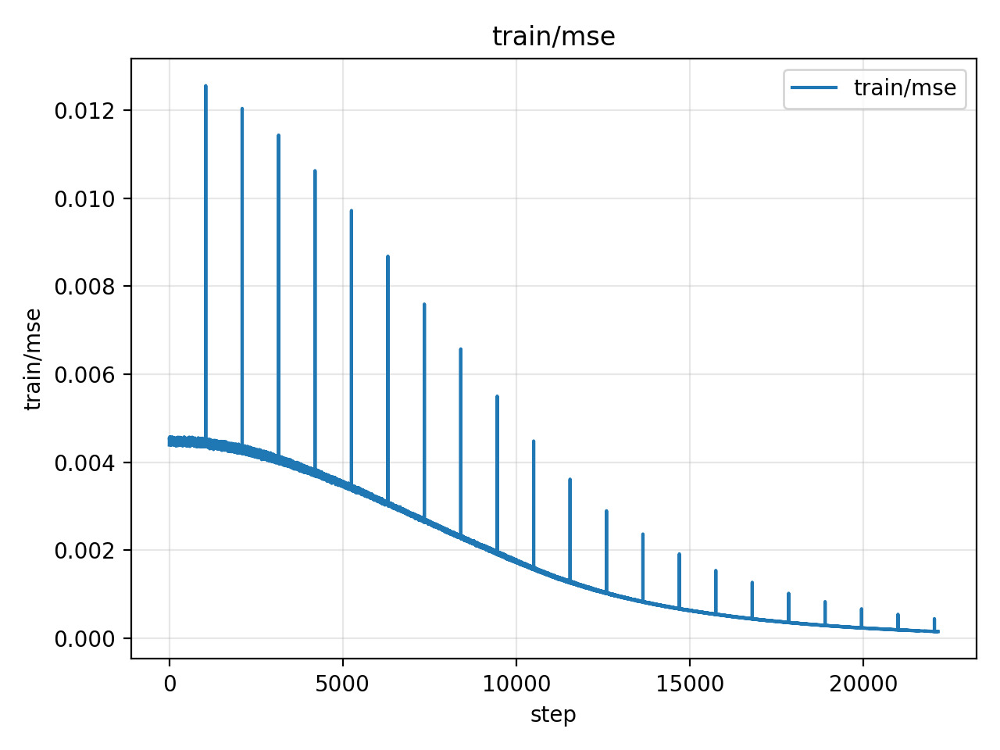
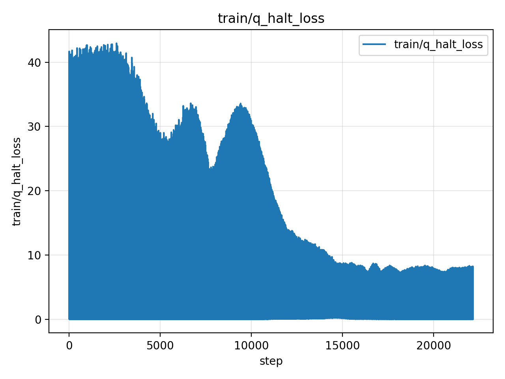
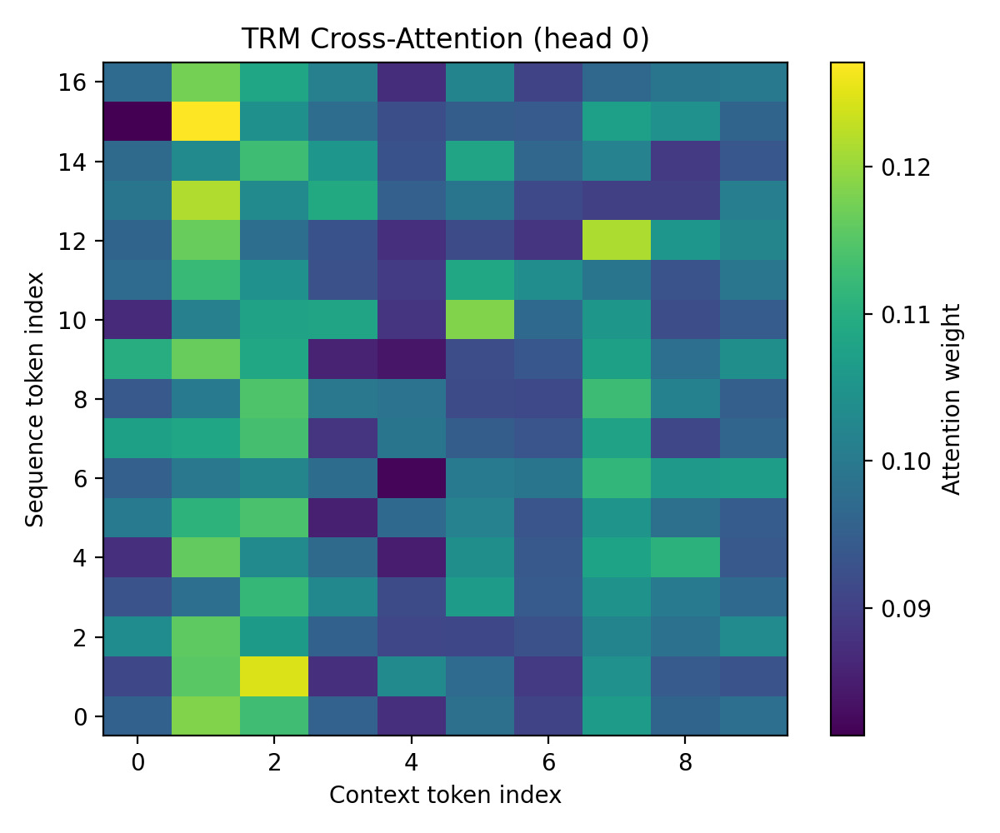

# BabyGR00T

> **v0.5 (corrected) — Work in Progress**
>
> *Efficient Vision-Language-Action Model via Stabilized Recursive Action Generation*
>
> *Minerva Labs · Monterrey, N.L., México*
>
> *VantTec · Monterrey, N.L., México*
>
> *RASTec · Monterrey, N.L., México*
>
> **Contact**
>
> | **Luis Sandoval** | [luisfsandsilva@gmail.com](mailto:luisfsandsilva@gmail.com) · [LinkedIn](https://www.linkedin.com/in/luisfsandsilva/) |
>
> | **Alex Hernández** | [alexhergomz@gmail.com](mailto:alexhergomz@gmail.com) · [LinkedIn](https://www.linkedin.com/in/alexhergomz/) |

---

> ⚠️ **Status: not finalized — testing under way.**
> The pipeline (data → CQ-VAE → vision cache → policy → eval) runs end-to-end
> and all four stages have been smoke-tested on real data, including a tiny
> OXE subset (`lerobot/svla_so101_pickplace`, 1 episode, 18 chunks ×
> 2 augmented variants, full InternVL3 + InternVL3 cache). Full-scale
> training runs on the OXE-scale dataset are **not yet validated**.
> Architecture, hyperparameter recipes, and APIs may still change.
> Do not treat any number in this repo as a finalized result.

---

## What this is

BabyGR00T is a research effort toward a small, generalizable
**Vision-Language-Action (VLA)** model — competitive manipulation in a
form factor suitable for resource-constrained robotic platforms (target:
single GPU, ≤16 GB VRAM, hours-not-days training).

**v0.5 (corrected)** is a course-correction from the original v0.5
formulation. The original plan (GR00T-teacher attention distillation +
EVS/GAP visual pruning + RQ-VAE + TRM-MaskGIT) is documented under
*Project history* below. After several training iterations we replaced
the action codebook (RQ-VAE → 3-level CQ-VAE), removed the GR00T teacher
distillation pathway, and replaced the swept TRM/MaskGIT decoder with a
**stabilized recursive policy (S-TRM)** with split-stream Parcae
contraction, Miyato spectral normalization, and outer-Parcae deep
supervision. That model is what this repo currently implements.

The current model has been tested on the SO-101 78-episode dataset
(`pavelsimo/SO-101-pick-and-place` + supplements). It is now being
ported to the OXE-equivalent `lerobot/svla_so101_pickplace` to break the
data-scarcity regime; that migration is underway.

---

## Repository layout

```
babygroot_strm/        # importable package (~1300 LOC)
├── cqvae.py           # RevIN, ActionRQUNet1d, VQ1d_EMA, cosine_snce_tau
├── vision.py          # InternVL3Vision, LayerAggregator, PerceiverResampler
├── policy.py          # STRMPolicy (current model)
├── optimizer.py       # MuSGD_LARS (Muon-NS + LARS, no scalar coeff)
├── data.py            # SO-101 + LeRobot/OXE streamers, ChunkDataset
├── augment.py         # cache-time visual + LLM-prompt augmentation
└── __init__.py
scripts/               # four CLI entry points
├── cache_vision.py    # extract InternVL3 features, w/ visual + prompt aug
├── train_cqvae.py     # train the action codebook
├── train_policy.py    # train the policy (default: v3 recipe)
└── eval_policy.py     # H-scaling top-k accuracy + action-space MSE
docs/
├── ARCHITECTURE.md    # full S-TRM derivation
└── RECIPES.md         # v3 / v4 / v5 recipes side-by-side
assets/                # preliminary illustrations (see Project history)
```

---

## Architecture (current, S-TRM)

A high-level summary follows; the full derivation is in
`docs/ARCHITECTURE.md`.

The policy joins three sources of information through cross-attention:

```
[ vis (128 latents) | state (1 token) ]      ←  cross-attn KV
[ L0 (4) | L1 (8) | L2 (16) ]                ←  query stream (28 tokens)
```

It maintains **two latent streams** `x1, x2 ∈ ℝ^{B × 28 × d}` and runs a
recursive update with deep supervision over the outer cycles:

```
inner step  (run L = 5 times):
  x1 = Ā₁ ⊙ x1 + (1/L) F(x2 + y, kv)    F = SelfAttn ∘ CrossAttn (conv-combo)
  x2 = Ā₂ ⊙ x2 + (1/L) G(x1 + y)        G = GeGLU FFN (conv-combo)

outer step  (run H times, deep supervision per cycle):
  logits = head(x1)
  y      = Ā_H ⊙ y + (1/H) candidate(logits, mask, gt)
```

Stability mechanisms (all load-bearing — they let H be increased at eval
without the recurrence diverging):

- **Miyato spectral normalization** on every linear (`σ_max(W) = 1`).
- **Parcae per-channel contraction** `Ā = exp(-|Δ|·exp(Ã)) ∈ (0,1)^d`,
  initialized at target ρ values per stream.
- **Convex-combo residual gates** `h ← (1-α)h + α·f(h)`, α ≈ 0.9 init.
- **Softmax-1 attention sink** so heads can abstain cleanly.

Action codebook: a **3-level convolutional CQ-VAE** (4 / 8 / 16 tokens,
K=128 each), with RevIN normalization and EMA codebook updates.

Vision: cached InternVL3-1B features (8-bit, frozen) + a learned
LayerAggregator over the 25 LLM-layer hidden states + a Flamingo-style
Perceiver resampler down to 128 latents.

Optimizer: **MuSGD + LARS** — Muon-style Newton-Schulz orthogonalization
on 2D weights, plain SGDM on 1D, per-parameter LARS trust ratio.

---

## Pipeline

Four stages, each independent and resumable. See `docs/RECIPES.md` for
full v3 / v4 / v5 commands.

```bash
# 1. Train the 3-level CQ-VAE on action chunks
python -m scripts.train_cqvae --steps 5000

# 2. Cache InternVL3 features for every chunk (one-time per dataset).
#    Optional: --n-vis-aug N for cached visual augmentation.
python -m scripts.cache_vision --cache-dir vision_cache

# 3. Train the policy (default = v3 recipe)
python -m scripts.train_policy --steps 25000

# 4. H-scaling eval — top-k accuracy + action-space MSE
python -m scripts.eval_policy so101_strm.pt
```

### Cache-time augmentation

Optional knob (off by default) — runs once during `cache_vision.py` so the
training loop only pays the disk-read cost:

| Flag | Default | Role |
|---|---:|---|
| `--n-vis-aug N` | 0 | Cache N visual variants per chunk (color jitter, blur, small crop). One transform applied identically to every frame in a chunk. |
| `--n-prompt-paraphrases K` | 20 | Pool size of paraphrases sampled from the built-in static bank; each variant draws one paraphrase from the pool. |

### Recipes (current — all unverified at scale)

- **v3** — current default. depth=2, dim=768, L=5, H~U{1..12}, plain CE,
  outer Parcae 1/H, mask curriculum, lr=9.5e-4. Best result so far on the
  78-episode SO-101 set: probe mean 12.4 % (likely a memorization upper
  bound — no held-out test split available at that data scale).
- **v4** — v3 + small action-space MSE through the frozen CQ-VAE decoder
  (expectation mode, all H cycles). The original v4 run with
  `argmax-STE + final-cycle-only + β=0.1` was an anti-pattern (mse_pol
  regressed); the corrected recipe uses smoother formulations.
- **v5** — v3 architecture trained on `lerobot/svla_so101_pickplace`
  (same SO-101 embodiment, ~50 episodes, ~12K frames). Migration code
  exists and the cache pipeline has been validated on a 1-episode subset;
  full-scale training has not run yet.

---

## Hardware platform

Primary validation target: **LeRobot SO-100/SO-101** — low-cost
open-source 6-DoF manipulators (5 arm joints + 1 gripper) with native
support in the LeRobot dataset ecosystem. Datasets currently used or
planned:

- `pavelsimo/SO-101-pick-and-place` — original 78-ep set (action_dim=6)
- `lerobot/svla_so101_pickplace` — OXE-style SO-101 (50 ep, in progress)
- `lerobot/bridge_data_v2` — fallback if SO-101 OXE is too small
  (60K trajectories, WidowX 6-DoF + gripper)

---

## Project history

The four illustrations in `assets/` are from earlier iterations of this
work and are kept for reference. They predate the current S-TRM design
and **should not be read as evidence for the current model.**

| Asset | What it shows | When |
|---|---|---|
| `assets/babygr00t_arch.jpeg` | Six-module architecture diagram (InternVL3 + EVS/GAP + Resampler + RQ-VAE + State-encoder + TRM-MaskGIT) | Original v0.5 (superseded). |
| `assets/preliminary_robocasa_result.gif/.mp4` | Drawer-opening demo on a RoboCasa simulation, early distillation pipeline | Pre-v0.5 PoC. |
| `assets/train_mse.jpeg` | Student MSE descending during teacher-distillation training | Original v0.5 distillation pipeline. |
| `assets/train_qhalt.jpeg` | Q-halt loss stabilizing during training | Original v0.5 (Q-halt was part of the swept-TRM ACT loop, dropped in S-TRM). |
| `assets/attn_map.jpeg` | TRM attention heatmap over visual tokens | Original v0.5 attention analysis. |

### What changed from the original v0.5

- **GR00T teacher distillation removed.** Attention-map distillation
  proved difficult to operationalize end-to-end; the current model is
  trained from scratch with no teacher.
- **RQ-VAE → CQ-VAE.** The action codebook moved to a 3-level
  convolutional VAE with EMA codebook + dead-code revival + RevIN
  normalization. Smaller, easier to train, and provides a hierarchical
  coarse→fine factorization that the policy exploits.
- **Swept TRM / MaskGIT → S-TRM.** The recursive policy now has explicit
  stability guarantees (Miyato spectral norm + Parcae contraction +
  convex-combo residuals + 1/L · 1/H scaling). Empirically this lets the
  same checkpoint use much larger H at eval than it was trained at,
  which the swept TRM did not support.
- **EVS/GAP token pruning dropped.** Cached InternVL3 features remove
  the per-step compute pressure that motivated EVS in the first place.
- **Q-halt + ACT loop dropped.** Replaced by deterministic H-cycle deep
  supervision. The model trains with `H ~ Uniform{1..h_max}` so test-time
  scaling is built into training rather than learned via Q-halt.

The original v0.5 PoC (drawer opening on RoboCasa) is below for reference.

### Original v0.5 — Preliminary RoboCasa demo

Early distillation run, drawer-opening task. Task completion is limited;
the goal of this artifact is to validate the (then-current) distillation
pipeline, not claim performance.


### Original v0.5 — Training metrics

Student MSE loss (left) and Q-halt loss (right) from the original
distillation pipeline. Both metrics belong to the v0.5 model superseded
by S-TRM and **do not characterize the current architecture**.

| MSE | Q-halt |
|---|---|
|  |  |

### Original v0.5 — Attention visualization

Self-attention map from the original swept-TRM model (head 0). The
current S-TRM model does not have a Q-halt loop and uses a different
attention sink (softmax-1), so this map is illustrative only.



---

## Setup

### Requirements

- Python 3.10+
- CUDA-capable GPU (~6 GB VRAM at v3 defaults; ~12 GB+ for larger configs)

### Installation

```bash
python -m venv venv
source venv/bin/activate
pip install -U pip setuptools wheel
pip install -e .
```

### Smoke test

```bash
python -c "
import torch
from babygroot_strm import STRMPolicy, SEQ_LENS_1D, NUM_RESAMPLER_LATENTS
m = STRMPolicy(seq_lens=tuple(SEQ_LENS_1D), k_codebook=128,
               dim=128, depth=2, L_inner=2, H_outer=2, state_dim=6,
               max_prefix=NUM_RESAMPLER_LATENTS+16,
               grad_checkpoint=False)
print(f'params: {sum(p.numel() for p in m.parameters())/1e6:.2f}M')
"
```

---

## Roadmap (subject to change)

| Milestone | Deliverable | Status |
|---|---|---|
| **v0.5 corrected** (this repo) | S-TRM v3 pipeline end-to-end on SO-101 78-ep + tiny OXE smoke test | **Code complete, training runs underway.** |
| v0.5 OXE | Full v3 retrain on `lerobot/svla_so101_pickplace`, with held-out test split | Not started — code path validated only. |
| v1.0 | Hardware deployment (SO-101), real-task evaluation | Future. |
| v1.5 | Cross-embodiment evaluation (BridgeData V2 / Fractal20220817) | Future. |
| v2.0 | World-model augmentation, RL fine-tuning | Future. |

---

## Citation

This work is unfinished and not yet ready for citation. The citation
block below is a placeholder; numbers and methodology will change as
training runs complete.

```bibtex
@misc{sandoval2026babygr00t,
  title        = {BabyGR00T v0.5 (corrected): A Stabilized Recursive Vision-Language-Action Model},
  author       = {Sandoval, L. F. and Hernández, A.},
  year         = {2026},
  note         = {Work in progress.},
  institution  = {Minerva Labs, VantTec, RASTec},
  address      = {Monterrey, N.L., México}
}
```

---

## References

- Alayrac et al. (2022). *Flamingo: a Visual Language Model for Few-Shot Learning.* NeurIPS 2022.
- Chang et al. (2022). *MaskGIT: Masked Generative Image Transformer.* CVPR 2022.
- Chen et al. (2024). *InternVL / InternVL3: Scaling up Vision Foundation Models.* arXiv 2024.
- Gu & Dao (2024). *Mamba: Linear-Time Sequence Modeling with Selective State Spaces.*
- Jolicoeur-Martineau (2025). *Less is More: Recursive Reasoning with Tiny Networks (TRM).* arXiv:2510.04871.
- Jordan et al. (2024). *Muon: Momentum-Orthogonalized Updates.*
- Kim et al. (2022). *Reversible Instance Normalization for Accurate Time-Series Forecasting.* ICLR 2022.
- Lee et al. (2022). *Autoregressive Image Generation using Residual Quantization (RQ-VAE).* CVPR 2022.
- Miller (2023). *Attention Is Off By One.* (softmax-1 attention sink)
- Miyato et al. (2018). *Spectral Normalization for Generative Adversarial Networks.*
- NVIDIA (2025). *Isaac GR00T N1 / N1.5 / N1.6.* HuggingFace: `nvidia/GR00T-N1.5-3B`, `nvidia/GR00T-N1.6-3B`.
- O'Neill et al. / Padalkar et al. (2023–2024). *Open X-Embodiment: Robotic Learning Datasets and RT-X Models.* ICRA 2024.
- Shazeer (2020). *GLU Variants Improve Transformer.*
- You et al. (2017). *LARS: Large Batch Training of CNNs with Layer-wise Adaptive Rate Scaling.*

---

## Acknowledgments

Developed as part of the **BabyGR00T** research effort on efficient
embodied intelligence at Minerva Labs, Monterrey, México. Thanks to
Samsung SAIL Montreal (TRM), the InternVL team, the LeRobot / HuggingFace
community, and NVIDIA Research for open-sourcing Isaac GR00T. GR00T
N1.5/N1.6 models and datasets are referenced solely for academic
comparison purposes.

---

## License

MIT.
